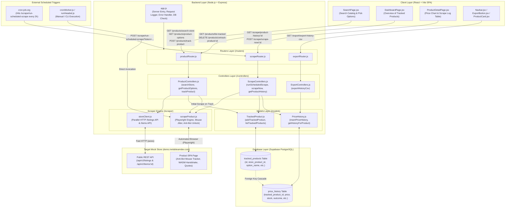

# 📖 INE Product Price Tracker — Comprehensive Project Guide

Welcome to the **Project Guide** for the **INE Product Price Tracker**. This guide explains every component, architectural layer, design decision, and source file in a serialized, step-by-step format.

Use this document alongside the codebase to understand the system end-to-end.

---

## 🗺️ System Architecture Flowchart



---

## 📂 Project Directory Structure

```text
INE_ProductPriceTracker/
├── README.md                                    # Project overview, setup, and submission note
├── ProjectGuide.md                              # This comprehensive architecture & code walkthrough
├── docs/                                        # Assignment specifications and notes
│   ├── Software_Engineer_Intern_Assignment.md   # Original assignment specification
│   ├── Product-Price-Tracker-Implementation-Plan.md # Technical implementation plan
│   └── SCRAPING_CHALLENGES_AND_DESIGN_NOTES.md  # Deep dive into all anti-bot problems & solutions
├── backend/
│   ├── .env                                     # Environment variables (ports, secrets, Supabase keys)
│   ├── .gitignore                               # Prevents node_modules and .env from leaking
│   ├── package.json                             # Dependencies: express, playwright, @supabase/supabase-js, axios
│   ├── supabase_schema.sql                      # SQL DDL for PostgreSQL tables and indexes
│   ├── app.js                                   # Main entry point, middleware, DB check, route mounting
│   ├── config/
│   │   └── supabaseClient.js                    # Initialized Supabase client instance
│   ├── models/
│   │   ├── TrackedProduct.js                    # Database operations for tracked_products table
│   │   └── PriceHistory.js                      # Database operations for price_history table
│   ├── routers/
│   │   ├── productRouter.js                     # Routes for catalog search, options, and tracking
│   │   ├── scrapeRouter.js                      # Routes for cron scraping, scrape-now, and history
│   │   └── exportRouter.js                      # Route for CSV history export download
│   ├── controllers/
│   │   ├── ProductControllers.js                # Search, options, and track logic (with initial scrape)
│   │   ├── ScrapeControllers.js                 # Scheduled cron loop, single-product scrapeNow, history
│   │   └── ExportControllers.js                 # Formats and streams full CSV history
│   └── scraper/
│       ├── storeClient.js                       # Fast HTTP client for catalog & options with memory cache
│       ├── scrapeProduct.js                     # Core Playwright engine: mouse jitter, unlock, price parser
│       ├── runHeaded.js                         # Visual headed browser run script for screen recording
│       └── cronWorker.js                        # Standalone CLI worker script for scheduled scraping
└── frontend/
    ├── index.html                               # HTML entry point, fonts, title
    ├── vite.config.js                           # Vite bundler configuration
    ├── package.json                             # Dependencies: react, react-dom, react-router-dom
    └── src/
        ├── main.jsx                             # React DOM bootstrap
        ├── App.jsx                              # Route declarations (/dashboard, /search, /product/:id)
        ├── index.css                            # Glassmorphism design system & typography
        ├── pages/
        │   ├── DashboardPage.jsx                # Tracked product cards board & quick stats
        │   ├── SearchPage.jsx                   # Live store catalog search & option picker
        │   └── ProductDetailPage.jsx            # Detailed stats, price chart, log table, "Scrape Now"
        └── components/shared/
            ├── Navbar.jsx                       # Top navigation bar
            ├── ProductCard.jsx                  # Individual product summary card for dashboard
            ├── PriceHistoryChart.jsx            # Dynamic HTML5 Canvas price-over-time trend graph
            ├── ScrapeLogTable.jsx               # Honest audit log table with status badges
            └── ExportButton.jsx                 # CSV export trigger button
```

---

## 🧠 Part 1: Backend Core Lifecycle (`backend/app.js`)

The entry point of the backend server is [backend/app.js](file:///e:/Pratham/Project%20Files/INE_Assignment/INE_ProductPriceTracker/backend/app.js).

### Responsibilities:
1. **Environment Configuration**: Calls `require('dotenv').config()` to load `SUPABASE_URL`, `SUPABASE_KEY`, `PORT`, and `CRON_SECRET`.
2. **CORS & Body Parsers**:
   - `app.use(cors({ origin: process.env.CLIENT_URL || '*' }))`: Allows the React frontend (running on `http://localhost:5173` locally or Vercel in production) to communicate without cross-origin blocks.
   - `app.use(express.json())`: Parses incoming JSON request payloads.
3. **Request Logger Middleware**:
   ```javascript
   app.use((req, res, next) => {
     const start = Date.now();
     res.on('finish', () => {
       const duration = Date.now() - start;
       const time = new Date().toLocaleTimeString();
       console.log(`[${time}] ${req.method} ${req.originalUrl} -> ${res.statusCode} (${duration}ms)`);
     });
     next();
   });
   ```
   Provides lightweight, clean console output showing the exact HTTP method, URL path, response code, and latency for every API call.
4. **Health Check Endpoint (`GET /health`)**:
   Returns `{ status: 'ok', timestamp: ... }`. Used by secondary cron jobs or uptime monitors to keep free-tier containers warm.
5. **Router Mounting**:
   - `/products` mounted to `productRouter`
   - `/scrape` mounted to `scrapeRouter`
   - `/export` mounted to `exportRouter`
6. **Global Error Handler**: Catches any unhandled errors in async routes and returns a sanitized JSON `{ error: err.message }` with HTTP 500.
7. **Database Verification on Startup**:
   Before accepting traffic, the server performs a test query against Supabase (`supabase.from('tracked_products').select('id').limit(1)`). If the connection or keys are invalid, an alert is printed in the terminal.

---

## 🗄️ Part 2: Database Layer & Configuration

### 1. `backend/config/supabaseClient.js`
Initializes a single, shared instance of `@supabase/supabase-js`:
```javascript
const { createClient } = require('@supabase/supabase-js');
const supabase = createClient(process.env.SUPABASE_URL, process.env.SUPABASE_KEY);
module.exports = supabase;
```
This client uses HTTPS/REST under the hood, making it stateless, connection-pool friendly, and immune to severed long-lived TCP connections when backends sleep.

### 2. `backend/supabase_schema.sql`
Defines the relational PostgreSQL schema in Supabase:

#### Table: `tracked_products`
Represents the global list of product options chosen for tracking.
| Column | Type | Description |
|---|---|---|
| `id` | `uuid PK` | Internal primary key (`gen_random_uuid()`) |
| `store_product_id` | `text` | Numeric ID from the store URL (e.g. `'2229'`) |
| `product_name` | `text` | Name of the product (e.g. `'Tamarack MIDI Keyboard Edge'`) |
| `option_name` | `text` | Specific variant selected (e.g. `'Instrument only'`, `'128 GB'`) |
| `option_index` | `int` | 1-based index corresponding to the UI option chips (`1, 2, 3...`) |
| `store_url` | `text` | Full URL to the product page on the mock store |
| `department` | `text` | Product category (e.g. `'Instruments'`, `'Networking'`) |
| `brand` | `text` | Brand manufacturer (e.g. `'Tamarack'`, `'Solvane'`) |
| `is_active` | `boolean` | Flag for soft-deletion (`true` by default) |
| `created_at` | `timestamptz` | Timestamp when tracking began |

- **Unique Constraint**: `unique (store_product_id, option_name)` guarantees **idempotency**. If a user tries to track the exact same option twice, it will not create duplicate rows.

#### Table: `price_history`
Serves as both the **price trend database** and the **honest scrape audit log**.
| Column | Type | Description |
|---|---|---|
| `id` | `uuid PK` | History record ID |
| `tracked_product_id` | `uuid FK` | Foreign key referencing `tracked_products(id)` with `ON DELETE CASCADE` |
| `price` | `numeric` | Parsed numeric price (e.g. `65047`). **NULL on failure** |
| `stock` | `text` | Stock status string (e.g. `'160 units available'`). **NULL on failure** |
| `scraped_at` | `timestamptz` | ISO 8601 UTC timestamp of the attempt |
| `outcome` | `text` | Status: `'success'`, `'retried'`, or `'failed'` |
| `attempt_count` | `int` | Number of attempts taken to resolve |
| `error_message` | `text` | Error description if failed/retried, otherwise `null` |

- **Index**: `idx_price_history_tracked_product` on `(tracked_product_id, scraped_at desc)` for millisecond query performance on charts and logs.

---

## 🏛️ Part 3: Data Access Models (`backend/models/`)

### 1. `backend/models/TrackedProduct.js`
Encapsulates all SQL queries for `tracked_products`:
- `addTrackedProduct({ ... })`: Checks if `(store_product_id, option_name)` already exists. If yes, returns existing record with `{ alreadyTracked: true }`. If no, inserts a new row.
- `listTrackedProducts()`: Returns all active tracked products (`is_active = true`), sorted newest first.
- `getTrackedProductById(id)`: Fetches a single tracked product by primary key.
- `untrackProduct(id)`: Sets `is_active = false` (soft-delete preserves historical records).

### 2. `backend/models/PriceHistory.js`
Encapsulates all SQL queries for `price_history`:
- `insertPriceHistory({ ... })`: Inserts one scrape attempt result. Handles nullifying price and stock if `outcome === 'failed'`.
- `getHistoryForProduct(trackedProductId)`: Returns all scrape attempts for one product, sorted by `scraped_at DESC`.
- `getAllHistoryForExport()`: Queries `price_history` with an inner join on `tracked_products` to prepare data for CSV export.

---

## 🚏 Part 4: API Routers & Controllers

### 1. Product Management (`/products`)
Router: [backend/routers/productRouter.js](file:///e:/Pratham/Project%20Files/INE_Assignment/INE_ProductPriceTracker/backend/routers/productRouter.js)  
Controller: [backend/controllers/ProductControllers.js](file:///e:/Pratham/Project%20Files/INE_Assignment/INE_ProductPriceTracker/backend/controllers/ProductControllers.js)

| Method | Endpoint | Controller Method | Purpose |
|---|---|---|---|
| `GET` | `/products/search-store?query=...` | `searchStore` | Queries mock store catalog by keyword (case-insensitive) |
| `GET` | `/products/product-options?storeUrl=...` | `getProductOptions` | Returns available variant chips for a product |
| `POST` | `/products/track-product` | `trackProduct` | Inserts into `tracked_products` and **runs immediate initial scrape** |
| `GET` | `/products/list-tracked` | `listTracked` | Returns all tracked products for the dashboard |
| `DELETE` | `/products/untrack-product/:id` | `untrack` | Deactivates product tracking |

**Key Feature in `trackProduct`**:
When a product is newly tracked (`!alreadyTracked`), the controller calls `scrapeProductWithRetry` before sending the HTTP 201 response. This ensures that the moment the user is redirected to the dashboard or product page, the first price, stock, and chart point are already present.

---

### 2. Scraping & History (`/scrape`)
Router: [backend/routers/scrapeRouter.js](file:///e:/Pratham/Project%20Files/INE_Assignment/INE_ProductPriceTracker/backend/routers/scrapeRouter.js)  
Controller: [backend/controllers/ScrapeControllers.js](file:///e:/Pratham/Project%20Files/INE_Assignment/INE_ProductPriceTracker/backend/controllers/ScrapeControllers.js)

| Method | Endpoint | Controller Method | Purpose |
|---|---|---|---|
| `POST` | `/scrape/run-scheduled-scrape?token=...` | `runScheduledScrape` | Triggered by external cron every 2 hours; validates secret and scrapes all active products |
| `POST` | `/scrape/scrape-now/:trackedProductId` | `scrapeNow` | On-demand immediate scrape trigger for a single product |
| `GET` | `/scrape/product-history/:trackedProductId` | `getProductHistory` | Returns history rows for price chart & table |
| `GET` | `/scrape/product-log/:trackedProductId` | `getProductLog` | Returns audit trail rows for scrape log table |

**Key Feature in `runScheduledScrape`**:
Because free-tier hosting proxies time out on long HTTP requests, this endpoint immediately validates `CRON_SECRET` and responds with `{ message: 'Scrape job started' }` (HTTP 200), then executes the batch scrape asynchronously in the background.

---

### 3. Data Export (`/export`)
Router: [backend/routers/exportRouter.js](file:///e:/Pratham/Project%20Files/INE_Assignment/INE_ProductPriceTracker/backend/routers/exportRouter.js)  
Controller: [backend/controllers/ExportControllers.js](file:///e:/Pratham/Project%20Files/INE_Assignment/INE_ProductPriceTracker/backend/controllers/ExportControllers.js)

| Method | Endpoint | Controller Method | Purpose |
|---|---|---|---|
| `GET` | `/export/export-history-csv` | `exportHistoryCsv` | Generates and streams full scrape history as a downloadable CSV |

**Format Compliance**:
Streams columns strictly per assignment requirements:
`store_product_id,product_name,option_name,timestamp,price,stock,outcome`
- Handles CSV escaping and double quotes for names with commas.
- Leaves `price` and `stock` completely empty on rows where `outcome === 'failed'`.

---

## ⚡ Part 5: The Scraping Engine (`backend/scraper/`)

The scraping engine is the technical core of the system.

### 1. `backend/scraper/storeClient.js` (Lightweight HTTP Client)
- **Problem Solved**: Browsing 48 catalog pages sequentially with Playwright took >15 seconds and triggered timeouts.
- **Solution**: The mock store exposes public JSON REST APIs:
  - Catalog: `/api/v2/listings?page=X&limit=60`
  - Item details: `/api/v2/items/:id`
- **Architecture**:
  - Uses `axios` with `Promise.all` across 16 pages to fetch all 960 products in ~240ms.
  - Caches the catalog in memory with a 15-minute TTL (`cachedCatalog`). Subsequent searches take `< 1ms`.
  - `fetchProductOptions(storeUrl)` fetches option chips in ~40ms via `/api/v2/items/:id`, falling back to Playwright only if the HTTP endpoint encounters an unexpected network error.

---

### 2. `backend/scraper/scrapeProduct.js` (The Automated Browser Engine)
Executes `scrapeProductWithRetry(storeUrl, optionIndex)`.

#### The 5-Step Anti-Bot Navigation Flow:
1. **Launch & Navigation**:
   Launches headless Chromium, navigates to `storeUrl`, and dismisses cookie consent scrim if visible.
2. **Option Chip Selection**:
   Waits for `.opt-chip` and clicks `chips[optionIndex - 1]`.
3. **Simulated Mouse Jitter & Dwell Time**:
   - The store's internal `Ar` tracker requires $\ge 8$ moves spaced by $\ge 40\text{ms}$ and $\ge 600\text{ms}$ dwell time.
   - Our engine scrolls `.offer-panel` into view, reads its bounding box, and emits 12 mouse movements across the box with 60ms pauses.
   - Waits 700ms for the dwell check.
   - Waits for the button inside `.offer-panel` to enable, then dispatches a trusted click.
4. **Dual-State Settlement Detection**:
   Waits dynamically for either `.offer-panel.offer-ready` (success) OR `.offer-panel.offer-failed` (store exhausted all 6 internal retries).
   - If `.offer-failed`, throws an error immediately to trigger backoff retry.
   - If `.offer-ready`, reads store attempts from `.offer-foot`.
5. **Unicode & Obfuscation Sanitizer (`parsePrice`)**:
   - Converts full-width digits (`０-９` / `\uFF10-\uFF19`) to standard ASCII digits.
   - Strips zero-width characters (`\u200B-\u200D`, `\uFEFF`) and non-breaking spaces.
   - Strips Euro-style `,00` cents and trailing `/- (incl. of all taxes)` text.
   - Safely parses clean integer price (e.g. `65047`).
6. **Outer Retry Loop & Honest Logging**:
   Wraps the entire flow in an outer 3-attempt retry loop with exponential backoff (2s, 5s). If all 3 fail, returns `{ price: null, stock: null, outcome: 'failed', errorMessage: ... }`.

---

### 3. `backend/scraper/runHeaded.js` (Observable Run for Screen Recording)
A standalone Node.js script configured with `headless: false` and `slowMo: 400`:
- Opens a visible browser window.
- Selects the option chip, performs mouse movements, unlocks the button, and clicks it.
- The viewer can observe the store's `"Retrying Attempt (x/6)"` indicator on-screen.
- Logs every retry attempt and outcome in real time to the terminal.
- **Usage**:
  ```powershell
  cd backend
  node scraper/runHeaded.js
  ```

---

### 4. `backend/scraper/cronWorker.js` (Standalone CLI Worker)
A standalone CLI script that can be executed directly from a terminal or system scheduler:
- Fetches all active products from `tracked_products`.
- Scrapes each product sequentially.
- Saves outcomes to `price_history`.
- **Usage**:
  ```powershell
  cd backend
  node scraper/cronWorker.js
  ```

---

## 🎨 Part 6: Frontend Client (`frontend/`)

Built with **React 18 + Vite** using **Vanilla CSS** and responsive glassmorphism.

### 1. `frontend/src/App.jsx`
Configures client-side routing using `react-router-dom`:
- `/` -> Redirects to `/dashboard` so reviewers immediately see live tracked products.
- `/dashboard` -> Renders `DashboardPage`.
- `/search` -> Renders `SearchPage`.
- `/product/:id` -> Renders `ProductDetailPage`.

### 2. `frontend/src/index.css`
A complete design system built with CSS variables:
- Color palette: Deep space dark theme (`--bg-primary: #0a0b10`, `--accent: #6366f1`, `--accent-glow: #818cf8`, `--success: #10b981`, `--warning: #f59e0b`, `--danger: #ef4444`).
- Glassmorphism tokens (`--surface-glass`, `backdrop-filter: blur(12px)`).
- Typography: Inter / system sans-serif hierarchy.
- Custom loading spinners, gradient text, badges, and responsive tables.

---

## 🖥️ Part 7: Frontend Pages (`frontend/src/pages/`)

### 1. `DashboardPage.jsx`
- **Lifecycle**:
  1. Calls `GET /products/list-tracked` on mount.
  2. For each tracked product, calls `GET /scrape/product-history/:id` in parallel to find its most recent price and stock.
- **UI Elements**:
  - Header with total count and schedule indicator (`scrapes every 2 hours`).
  - Top action bar: `ExportButton` and `＋ Track Product`.
  - Empty state with a direct link to Search if no products are tracked.
  - Grid of `ProductCard` components showing current price, stock badge, last scraped time, and an untrack button.

### 2. `SearchPage.jsx`
- **Lifecycle**:
  1. User enters partial or full product name (e.g. `'Keyboard'`, `'Tablet'`) and clicks Search or hits `Enter`.
  2. Calls `GET /products/search-store?query=...` (served in `< 1ms` from cache).
  3. Clicking a search result card triggers `GET /products/product-options?storeUrl=...` to load option chips.
  4. User clicks an option chip and clicks **"Track this option"**.
  5. Calls `POST /products/track-product` (which runs the initial scrape) and redirects to `/dashboard`.

### 3. `ProductDetailPage.jsx`
- **Lifecycle**:
  1. Reads `:id` from route parameters.
  2. Fetches product metadata and full price history (`GET /scrape/product-history/:id`).
- **UI Elements**:
  - Back button (`← Back to Dashboard`).
  - Breadcrumb and product details (`Brand`, `Department`, `Store ID`, `View on store ↗`).
  - Action buttons: **`🔄 Scrape Now`** (runs on-demand scrape) and **`Export CSV`**.
  - **Empty History Banner**: If a product was just added and has no history, a callout card appears with a **`⚡ Run First Scrape Now`** button.
  - **Stats Cards**:
    - Current Price (accent color)
    - Lowest Seen (green)
    - Highest Seen (yellow)
    - Total Scrapes (white)
    - Failed Scrapes (red)
  - **Tab Switcher**: Toggle between `📈 Price Chart` and `📋 Scrape Log`.

---

## 🧩 Part 8: Shared Components (`frontend/src/components/shared/`)

### 1. `Navbar.jsx`
Global header rendered across all pages. Features the brand logo (`PriceTracker`), live navigation links (`Search`, `Dashboard`), and active link indicators.

### 2. `ProductCard.jsx`
Card component used on `DashboardPage`:
- Displays product name, department tag, and option name.
- Shows current price formatted in Indian Rupees (`₹XX,XXX`).
- Displays stock status pill (`In Stock`, `Available (x)`, `Sold out`).
- Displays relative last scrape timestamp (e.g., `'10m ago'`).
- Untrack icon button with confirmation prompt.
- Clicking the card navigates to `/product/:id`.

### 3. `PriceHistoryChart.jsx`
Canvas-based price trend visualization:
- Plots successful scrape data points chronologically.
- Draws smooth gradient area fill under the line.
- Automatically calculates Y-axis price intervals and X-axis date labels.
- Interactive hover tooltip showing exact date, time, and price.

### 4. `ScrapeLogTable.jsx`
Full audit trail table showing every scrape attempt:
- Columns: Timestamp (formatted local time), Outcome badge (`Success`, `Retried`, `Failed`), Price, Stock, Attempt Count, Error details.
- Displays failures honestly with price/stock empty and error description.

### 5. `ExportButton.jsx`
Triggers direct download of the full scrape history CSV from `GET /export/export-history-csv`. Shows a loading spinner while the file is prepared.

---

## 🔄 Part 9: End-to-End Execution Traces

### Trace A: Adding and Tracking a Product
1. User types `'Tablet'` on `SearchPage.jsx`.
2. Frontend calls `GET /products/search-store?query=Tablet`.
3. Backend checks in-memory catalog cache (`storeClient.js`). Finds matches in 0.4ms.
4. User selects `'Halvard Tablet One'` -> Frontend calls `GET /products/product-options`.
5. User selects `'128 GB'` and clicks `'＋ Track this option'`.
6. Frontend calls `POST /products/track-product`.
7. Backend inserts row into `tracked_products` table.
8. Backend immediately launches `scrapeProductWithRetry`, moves mouse across `.offer-panel`, clicks unlocked price button, resolves price (`₹94,270`), and writes initial row to `price_history`.
9. Frontend redirects to `/dashboard`. The card immediately displays **₹94,270**!

### Trace B: On-Demand Manual Scrape
1. User visits `/product/:id` and clicks **`🔄 Scrape Now`**.
2. Frontend calls `POST /scrape/scrape-now/:id`.
3. Backend runs `scrapeProductWithRetry` against the mock store.
4. New row is inserted into `price_history`.
5. Frontend re-fetches history and re-renders the stats, chart, and scrape log in real time.

### Trace C: Unattended 2-Hour Cron Run
1. [cron-job.org](https://cron-job.org) sends `POST /scrape/run-scheduled-scrape?token=<SECRET>` every 2 hours.
2. Backend validates `token`.
3. Backend responds HTTP 200 immediately (`{ message: 'Scrape job started' }`).
4. In background, backend queries `tracked_products` for all active items.
5. Loops through each product, scrapes current price and stock, and writes rows to `price_history`.
6. Terminal logs each outcome (`[CRON] Done: Tamarack MIDI Keyboard Edge — success (price: 65047)`).
