# 📖 INE Product Price Tracker — Comprehensive Project Guide

Welcome to the **Project Guide** for the **INE Product Price Tracker**. This guide explains every component, architectural layer, design decision, and source file in a serialized, step-by-step format.

Use this document alongside the codebase to understand the system end-to-end.

---

## 🗺️ System Architecture Flowchart

```mermaid
flowchart TD
    subgraph Client ["Client Layer (React + Vite SPA)"]
        UI_Dash["DashboardPage.jsx\n(Overview of Tracked Products)"]
        UI_Detail["ProductDetailPage.jsx\n(Price Chart & Scrape Log Table)"]
        UI_Nav["Navbar.jsx / ExportButton.jsx / ProductCard.jsx"]
        UI_Search["SearchOverlay.jsx\n(Debounced Modal via Ctrl+K or Navbar)"]
        UI_Bell["NotificationBell.jsx\n(Real-Time Unread Badge & Alerts)"]
        UI_Theme["ThemeContext.jsx / SearchContext.jsx"]
    end

    subgraph External_Triggers ["External Scheduled Triggers & Watchdogs"]
        CronOrg["cron-job.org\n(Hits /scrape/run-scheduled-scrape every 2h)"]
        CLI_Worker["cronWorker.js / runHeaded.js\n(Manual / CLI Execution)"]
        GH_Actions["GitHub Actions Workflows\n(ci.yml & store-watchdog.yml)"]
    end

    subgraph Backend_Server ["Backend Layer (Node.js + Express)"]
        App["app.js\n(Server Entry, Request Logger, Error Handler, DB Check)"]
        
        subgraph Routers ["Routers Layer (/routers)"]
            R_Prod["productRouter.js"]
            R_Scrape["scrapeRouter.js"]
            R_Export["exportRouter.js"]
            R_Notif["notificationRouter.js"]
        end

        subgraph Controllers ["Controllers Layer (/controllers)"]
            C_Prod["ProductControllers.js\n(searchStore, getProductOptions, trackProduct)"]
            C_Scrape["ScrapeControllers.js\n(runScheduledScrape, scrapeNow, getProductHistory)"]
            C_Export["ExportControllers.js\n(exportHistoryCsv)"]
        end

        subgraph Models ["Models Layer (/models)"]
            M_Prod["TrackedProduct.js\n(addTrackedProduct, listTrackedProducts)"]
            M_Hist["PriceHistory.js\n(insertPriceHistory, getHistoryForProduct)"]
            M_Notif["Notification.js\n(createNotification, listNotifications, markAsRead)"]
        end

        subgraph Scraper ["Scraper Engine (/scraper)"]
            S_Client["storeClient.js\n(Parallel HTTP /listings API & /items API)"]
            S_Scrape["scrapeProduct.js\n(Playwright Engine, Mouse Jitter, Inner Retries)"]
            S_Alert["alertEngine.js\n(Price Drop, Back in Stock, Structure Change Alerts)"]
            S_Canary["detectStructureChange.js\n(DOM Contract & Anti-Bot Canary)"]
        end
    end

    subgraph Database ["Database Layer (Supabase PostgreSQL)"]
        DB_TP[("tracked_products Table\n(id, store_product_id, option_name, etc.)")]
        DB_PH[("price_history Table\n(tracked_product_id, price, stock, outcome, etc.)")]
        DB_NOTIF[("notifications Table\n(tracked_product_id, type, message, is_read, etc.)")]
    end

    subgraph Target_Store ["Target Mock Store (demo.inelabteamdev.com)"]
        Store_API["Public REST API\n(/api/v2/listings & /api/v2/items/:id)"]
        Store_Page["Product SPA Page\n(Anti-Bot Mouse Tracker, WASM Handshake, Quotes)"]
    end

    %% Client Interactions
    UI_Search -->|"GET /products/search-store\nGET /products/product-options\nPOST /products/track-product"| R_Prod
    UI_Dash -->|"GET /products/list-tracked\nDELETE /products/untrack-product/:id"| R_Prod
    UI_Detail -->|"GET /scrape/product-history/:id\nPOST /scrape/scrape-now/:id"| R_Scrape
    UI_Nav -->|"GET /export/export-history-csv"| R_Export
    UI_Bell -->|"GET /notifications\nGET /notifications/count\nPATCH /notifications/:id/read"| R_Notif

    %% External Triggers
    CronOrg -->|"POST /scrape/run-scheduled-scrape?token=..."| R_Scrape
    CLI_Worker -->|"Direct invocation"| S_Scrape
    GH_Actions -->|"Canary verification"| S_Canary

    %% Routing to Controllers
    App --> Routers
    R_Prod --> C_Prod
    R_Scrape --> C_Scrape
    R_Export --> C_Export
    R_Notif --> M_Notif

    %% Controllers to Scrapers & Models
    C_Prod --> S_Client
    C_Prod --> M_Prod
    C_Prod -->|"Initial Scrape on Track"| S_Scrape
    C_Scrape --> S_Scrape
    C_Scrape --> M_Prod
    C_Scrape --> M_Hist
    C_Scrape --> S_Alert
    C_Export --> M_Hist

    %% Scraper to Alert Engine
    S_Scrape -->|"Scrape Result"| S_Alert
    S_Alert -->|"Insert Notification"| M_Notif

    %% Models to Database
    M_Prod <--> DB_TP
    M_Hist <--> DB_PH
    M_Notif <--> DB_NOTIF
    DB_TP -.->|"Foreign Key Cascade"| DB_PH
    DB_TP -.->|"Foreign Key Cascade"| DB_NOTIF

    %% Scrapers to Target Store
    S_Client <-->|"Fast HTTP (axios)"| Store_API
    S_Scrape <-->|"Automated Browser (Playwright)"| Store_Page
    S_Canary <-->|"DOM Contract Verification"| Store_Page
```



---

## 📂 Project Directory Structure

```text
INE_ProductPriceTracker/
├── .github/
│   └── workflows/
│       ├── ci.yml                               # GitHub Actions CI: lint, build, syntax check, store canary
│       └── store-watchdog.yml                   # Scheduled watchdog running daily store structure tests
├── README.md                                    # Project overview, setup, and bonus feature docs
├── ProjectGuide.md                              # This comprehensive architecture & code walkthrough
├── docs/                                        # Assignment specifications and notes
│   ├── Software_Engineer_Intern_Assignment.md   # Original assignment specification
│   ├── Product-Price-Tracker-Implementation-Plan.md # Technical implementation plan
│   └── SCRAPING_CHALLENGES_AND_DESIGN_NOTES.md  # Deep dive into all anti-bot problems & solutions
├── backend/
│   ├── .env                                     # Environment variables (ports, secrets, Supabase keys)
│   ├── .gitignore                               # Prevents node_modules and .env from leaking
│   ├── package.json                             # Dependencies, scripts (test:structure, check, start)
│   ├── supabase_schema.sql                      # Complete SQL DDL for all PostgreSQL tables and indexes
│   ├── supabase_notifications_migration.sql     # Migration script for notifications table & indexes
│   ├── app.js                                   # Main entry point, middleware, DB check, route mounting
│   ├── config/
│   │   └── supabaseClient.js                    # Initialized Supabase client instance
│   ├── models/
│   │   ├── TrackedProduct.js                    # Database operations for tracked_products table
│   │   ├── PriceHistory.js                      # Database operations for price_history table
│   │   └── Notification.js                      # Database operations for notifications table
│   ├── routers/
│   │   ├── productRouter.js                     # Routes for catalog search, options, and tracking
│   │   ├── scrapeRouter.js                      # Routes for cron scraping, scrape-now, and history
│   │   ├── exportRouter.js                      # Route for CSV history export download
│   │   └── notificationRouter.js                # Routes for in-app alert counts, listings, read status
│   ├── controllers/
│   │   ├── ProductControllers.js                # Search, options, and track logic (with initial scrape)
│   │   ├── ScrapeControllers.js                 # Scheduled cron loop, single-product scrapeNow, history
│   │   └── ExportControllers.js                 # Formats and streams full CSV history
│   └── scraper/
│       ├── storeClient.js                       # Fast HTTP client for catalog & options with memory cache
│       ├── scrapeProduct.js                     # Core Playwright engine: jitter, inner retries, price parser
│       ├── alertEngine.js                       # Compares scrape results to fire price-drop & stock alerts
│       ├── detectStructureChange.js             # Standalone & CI canary test verifying store DOM contracts
│       ├── runHeaded.js                         # Visual headed browser run script for screen recording
│       └── cronWorker.js                        # Standalone CLI worker script for scheduled scraping
└── frontend/
    ├── index.html                               # HTML entry point, fonts, title
    ├── vite.config.js                           # Vite bundler configuration
    ├── package.json                             # Dependencies: react, react-dom, react-router-dom, lucide-react
    └── src/
        ├── main.jsx                             # React DOM bootstrap
        ├── App.jsx                              # Route declarations wrapped in Theme & Search Providers
        ├── index.css                            # Dual dark/light theme design system, typography, animations
        ├── context/
        │   ├── ThemeContext.jsx                 # Dark/Light mode theme state with localStorage persistence
        │   └── SearchContext.jsx                # Global search overlay open/close & trigger state
        ├── pages/
        │   ├── DashboardPage.jsx                # Tracked product cards board, stats, and search overlay trigger
        │   └── ProductDetailPage.jsx            # Detailed stats, price chart, log table, "Scrape Now"
        └── components/shared/
            ├── Navbar.jsx                       # Top navigation bar with theme toggle & notification bell
            ├── NotificationBell.jsx             # Notification bell with unread badge & alert dropdown drawer
            ├── SearchOverlay.jsx                # Global 2-3s debounced search modal with Ctrl+K shortcut
            ├── ProductCard.jsx                  # Entirely clickable product card with status pills
            ├── PriceHistoryChart.jsx            # Canvas chart with custom hover overlay nodes & time marks
            ├── ScrapeLogTable.jsx               # Audit log table with "Read more" buttons for long errors
            └── ExportButton.jsx                 # CSV export trigger button
```

---

## 🧠 Part 1: Backend Core Lifecycle (`backend/app.js`)

The entry point of the backend server is [backend/app.js](file:///e:/Pratham/Project%20Files/INE_Assignment/INE_ProductPriceTracker/backend/app.js).

### Responsibilities:
1. **Environment Configuration**: Calls `require('dotenv').config()` to load `SUPABASE_URL`, `SUPABASE_KEY`, `PORT`, and `CRON_SECRET`.
2. **CORS & Body Parsers**:
   - `app.use(cors({ origin: process.env.CLIENT_URL || '*' }))`: Allows the React frontend (running on `http://localhost:5173` locally or Vercel in production) to communicate without cross-origin blocks.
   - `app.use(express.json())`: Parses incoming JSON request payloads.
3. **Request Logger Middleware**:
   ```javascript
   app.use((req, res, next) => {
     const start = Date.now();
     res.on('finish', () => {
       const duration = Date.now() - start;
       const time = new Date().toLocaleTimeString();
       console.log(`[${time}] ${req.method} ${req.originalUrl} -> ${res.statusCode} (${duration}ms)`);
     });
     next();
   });
   ```
   Provides lightweight, clean console output showing the exact HTTP method, URL path, response code, and latency for every API call.
4. **Health Check Endpoint (`GET /health`)**:
   Returns `{ status: 'ok', timestamp: ... }`. Used by secondary cron jobs or uptime monitors to keep free-tier containers warm.
5. **Router Mounting**:
   - `/products` mounted to `productRouter`
   - `/scrape` mounted to `scrapeRouter`
   - `/export` mounted to `exportRouter`
   - `/notifications` mounted to `notificationRouter`
6. **Global Error Handler**: Catches any unhandled errors in async routes and returns a sanitized JSON `{ error: err.message }` with HTTP 500.
7. **Database Verification on Startup**:
   Before accepting traffic, the server performs a test query against Supabase (`supabase.from('tracked_products').select('id').limit(1)`). If the connection or keys are invalid, an alert is printed in the terminal.

---

## 🗄️ Part 2: Database Layer & Configuration

### 1. `backend/config/supabaseClient.js`
Initializes a single, shared instance of `@supabase/supabase-js`:
```javascript
const { createClient } = require('@supabase/supabase-js');
const supabase = createClient(process.env.SUPABASE_URL, process.env.SUPABASE_KEY);
module.exports = supabase;
```
This client uses HTTPS/REST under the hood, making it stateless, connection-pool friendly, and immune to severed long-lived TCP connections when backends sleep.

### 2. `backend/supabase_schema.sql` & `backend/supabase_notifications_migration.sql`
Defines the relational PostgreSQL schema in Supabase:

#### Table: `tracked_products`
Represents the global list of product options chosen for tracking.
| Column | Type | Description |
|---|---|---|
| `id` | `uuid PK` | Internal primary key (`gen_random_uuid()`) |
| `store_product_id` | `text` | Numeric ID from the store URL (e.g. `'2229'`) |
| `product_name` | `text` | Name of the product (e.g. `'Tamarack MIDI Keyboard Edge'`) |
| `option_name` | `text` | Specific variant selected (e.g. `'Instrument only'`, `'128 GB'`) |
| `option_index` | `int` | 1-based index corresponding to the UI option chips (`1, 2, 3...`) |
| `store_url` | `text` | Full URL to the product page on the mock store |
| `department` | `text` | Product category (e.g. `'Instruments'`, `'Networking'`) |
| `brand` | `text` | Brand manufacturer (e.g. `'Tamarack'`, `'Solvane'`) |
| `is_active` | `boolean` | Flag for soft-deletion (`true` by default) |
| `created_at` | `timestamptz` | Timestamp when tracking began |

- **Unique Constraint**: `unique (store_product_id, option_name)` guarantees **idempotency**. If a user tries to track the exact same option twice, it will not create duplicate rows.

#### Table: `price_history`
Serves as both the **price trend database** and the **honest scrape audit log**.
| Column | Type | Description |
|---|---|---|
| `id` | `uuid PK` | History record ID |
| `tracked_product_id` | `uuid FK` | Foreign key referencing `tracked_products(id)` with `ON DELETE CASCADE` |
| `price` | `numeric` | Parsed numeric price (e.g. `65047`). **NULL on failure** |
| `stock` | `text` | Stock status string (e.g. `'160 units available'`). **NULL on failure** |
| `scraped_at` | `timestamptz` | ISO 8601 UTC timestamp of the attempt |
| `outcome` | `text` | Status: `'success'`, `'retried'`, or `'failed'` |
| `attempt_count` | `int` | Number of attempts taken to resolve |
| `error_message` | `text` | Error description if failed/retried, otherwise `null` |

- **Index**: `idx_price_history_tracked_product` on `(tracked_product_id, scraped_at desc)` for millisecond query performance on charts and logs.

#### Table: `notifications`
Powers the in-app notification center for real-time price-drop, back-in-stock, and page-structure change alerts.
| Column | Type | Description |
|---|---|---|
| `id` | `uuid PK` | Auto-generated unique row ID (`gen_random_uuid()`) |
| `tracked_product_id` | `uuid FK` | References `tracked_products(id)` with `ON DELETE CASCADE` |
| `type` | `text` | Alert category: `'price_drop'`, `'back_in_stock'`, or `'structure_changed'` |
| `message` | `text` | Human-readable notification summary text |
| `old_value` | `text` | Previous price or stock value (nullable) |
| `new_value` | `text` | Updated price or stock value (nullable) |
| `is_read` | `boolean` | Read status (`false` by default) |
| `created_at` | `timestamptz` | Timestamp when notification was created (`now()`) |

- **Indexes**:
  - `idx_notifications_unread`: `(is_read, created_at desc)` for fast unread count badge queries.
  - `idx_notifications_product`: `(tracked_product_id, created_at desc)` for per-product alerts.

---

## 🏛️ Part 3: Data Access Models (`backend/models/`)

### 1. `backend/models/TrackedProduct.js`
Encapsulates all SQL queries for `tracked_products`:
- `addTrackedProduct({ ... })`: Checks if `(store_product_id, option_name)` already exists. If yes, returns existing record with `{ alreadyTracked: true }`. If no, inserts a new row.
- `listTrackedProducts()`: Returns all active tracked products (`is_active = true`), sorted newest first.
- `getTrackedProductById(id)`: Fetches a single tracked product by primary key.
- `untrackProduct(id)`: Sets `is_active = false` (soft-delete preserves historical records).

### 2. `backend/models/PriceHistory.js`
Encapsulates all SQL queries for `price_history`:
- `insertPriceHistory({ ... })`: Inserts one scrape attempt result. Handles nullifying price and stock if `outcome === 'failed'`.
- `getHistoryForProduct(trackedProductId)`: Returns all scrape attempts for one product, sorted by `scraped_at DESC`.
- `getAllHistoryForExport()`: Queries `price_history` with an inner join on `tracked_products` to prepare data for CSV export.

### 3. `backend/models/Notification.js`
Encapsulates all SQL queries for `notifications`:
- `createNotification({ trackedProductId, type, message, oldValue, newValue })`: Inserts a new alert row into Supabase.
- `listNotifications({ unreadOnly })`: Returns up to 50 notifications ordered newest first, joined with `tracked_products` to include `product_name` and `option_name`.
- `countUnread()`: Fast exact count query for unread alerts (powers the navbar bell badge).
- `markAsRead(id)`: Marks an individual notification as read.
- `markAllAsRead()`: Marks all unread notifications as read simultaneously.
- `getLastSuccessfulHistory(trackedProductId)`: Queries the 2 most recent successful price history rows to compare previous price vs new price.

---

## 🚏 Part 4: API Routers & Controllers

### 1. Product Management (`/products`)
Router: [backend/routers/productRouter.js](file:///e:/Pratham/Project%20Files/INE_Assignment/INE_ProductPriceTracker/backend/routers/productRouter.js)  
Controller: [backend/controllers/ProductControllers.js](file:///e:/Pratham/Project%20Files/INE_Assignment/INE_ProductPriceTracker/backend/controllers/ProductControllers.js)

| Method | Endpoint | Controller Method | Purpose |
|---|---|---|---|
| `GET` | `/products/search-store?query=...` | `searchStore` | Queries mock store catalog by keyword (case-insensitive) |
| `GET` | `/products/product-options?storeUrl=...` | `getProductOptions` | Returns available variant chips for a product |
| `POST` | `/products/track-product` | `trackProduct` | Inserts into `tracked_products` and **runs immediate initial scrape** |
| `GET` | `/products/list-tracked` | `listTracked` | Returns all tracked products for the dashboard |
| `DELETE` | `/products/untrack-product/:id` | `untrack` | Deactivates product tracking |

**Key Feature in `trackProduct`**:
When a product is newly tracked (`!alreadyTracked`), the controller calls `scrapeProductWithRetry` before sending the HTTP 201 response. This ensures that the moment the user is redirected to the dashboard or product page, the first price, stock, and chart point are already present.

---

### 2. Scraping & History (`/scrape`)
Router: [backend/routers/scrapeRouter.js](file:///e:/Pratham/Project%20Files/INE_Assignment/INE_ProductPriceTracker/backend/routers/scrapeRouter.js)  
Controller: [backend/controllers/ScrapeControllers.js](file:///e:/Pratham/Project%20Files/INE_Assignment/INE_ProductPriceTracker/backend/controllers/ScrapeControllers.js)

| Method | Endpoint | Controller Method | Purpose |
|---|---|---|---|
| `POST` | `/scrape/run-scheduled-scrape?token=...` | `runScheduledScrape` | Triggered by external cron every 2 hours; validates secret and scrapes all active products |
| `POST` | `/scrape/scrape-now/:trackedProductId` | `scrapeNow` | On-demand immediate scrape trigger for a single product |
| `GET` | `/scrape/product-history/:trackedProductId` | `getProductHistory` | Returns history rows for price chart & table |
| `GET` | `/scrape/product-log/:trackedProductId` | `getProductLog` | Returns audit trail rows for scrape log table |

**Key Feature in `runScheduledScrape`**:
Because free-tier hosting proxies time out on long HTTP requests, this endpoint immediately validates `CRON_SECRET` and responds with `{ message: 'Scrape job started' }` (HTTP 200), then executes the batch scrape asynchronously in the background. After each product is scraped, it triggers `checkAndFireAlerts` to notify users of any price drops or stock changes.

---

### 3. Data Export (`/export`)
Router: [backend/routers/exportRouter.js](file:///e:/Pratham/Project%20Files/INE_Assignment/INE_ProductPriceTracker/backend/routers/exportRouter.js)  
Controller: [backend/controllers/ExportControllers.js](file:///e:/Pratham/Project%20Files/INE_Assignment/INE_ProductPriceTracker/backend/controllers/ExportControllers.js)

| Method | Endpoint | Controller Method | Purpose |
|---|---|---|---|
| `GET` | `/export/export-history-csv` | `exportHistoryCsv` | Generates and streams full scrape history as a downloadable CSV |

**Format Compliance**:
Streams columns strictly per assignment requirements:
`store_product_id,product_name,option_name,timestamp,price,stock,outcome`
- Handles CSV escaping and double quotes for names with commas.
- Leaves `price` and `stock` completely empty on rows where `outcome === 'failed'`.

---

### 4. Notifications & In-App Alerts (`/notifications`)
Router: [backend/routers/notificationRouter.js](file:///e:/Pratham/Project%20Files/INE_Assignment/INE_ProductPriceTracker/backend/routers/notificationRouter.js)

| Method | Endpoint | Purpose |
|---|---|---|
| `GET` | `/notifications` | Returns list of recent notifications (up to 50, supports `?unread=true`) |
| `GET` | `/notifications/count` | Returns `{ count: number }` for the navbar bell badge |
| `PATCH` | `/notifications/:id/read` | Marks a single notification as read |
| `PATCH` | `/notifications/read-all` | Marks all notifications as read in a single batch |

---

## ⚡ Part 5: The Scraping Engine (`backend/scraper/`)

The scraping engine is the technical core of the system.

### 1. `backend/scraper/storeClient.js` (Lightweight HTTP Client)
- **Problem Solved**: Browsing 48 catalog pages sequentially with Playwright took >15 seconds and triggered timeouts.
- **Solution**: The mock store exposes public JSON REST APIs:
  - Catalog: `/api/v2/listings?page=X&limit=60`
  - Item details: `/api/v2/items/:id`
- **Architecture**:
  - Uses `axios` with `Promise.all` across 16 pages to fetch all 960 products in ~240ms.
  - Caches the catalog in memory with a 15-minute TTL (`cachedCatalog`). Subsequent searches take `< 1ms`.
  - `fetchProductOptions(storeUrl)` fetches option chips in ~40ms via `/api/v2/items/:id`, falling back to Playwright only if the HTTP endpoint encounters an unexpected network error.

---

### 2. `backend/scraper/scrapeProduct.js` (The Automated Browser Engine)
Executes `scrapeProductWithRetry(storeUrl, optionIndex)`.

#### The Complete Anti-Bot Navigation & Settlement Flow:
1. **Launch & Navigation**:
   Launches headless Chromium (configured with standard user-agent and viewport), navigates to `storeUrl`, and dismisses the cookie consent banner.
2. **Option Chip Selection**:
   Waits for `.opt-chip` and clicks `chips[optionIndex - 1]` corresponding to the tracked option.
3. **Simulated Mouse Jitter & Dwell Time**:
   - The store's internal `Ar` tracker requires $\ge 8$ moves spaced by $\ge 40\text{ms}$ and $\ge 600\text{ms}$ dwell time.
   - Our engine scrolls `.offer-panel` into view, reads its bounding box, and emits 12 mouse movements across the box with 60ms pauses.
   - Waits 700ms for the dwell check.
   - Waits for the button inside `.offer-panel` to enable.
4. **Two-Tier Inner Challenge-Retry Loop**:
   - **Click 1**: Clicks the initial "Check Today's Price" button.
   - **Clicks 2–5 (headless) / 2–10 (headed)**:
     - Waits for the panel to transition to `.offer-ready` or `.offer-failed`.
     - If `.offer-failed` occurs with an error message containing `'challenge'`, `'handshake'`, or `'unauthorized'`, the error panel renders an in-place "Retry" button.
     - The scraper waits 2 seconds and clicks this "Retry" button repeatedly within the same browser session.
     - If the challenge resolves successfully on attempt 2+, `outcome` is marked as `'retried'`.
   - **Fast-Break on Quote Exhaustion (`StoreExhaustedError`)**:
     - If the store itself ran all 6 internal retries and failed with a quote-API error, running outer retries is useless.
     - Throws `StoreExhaustedError`, exiting the outer loop immediately to record an honest failure without wasting 3+ minutes.
   - **Structure Change Detection**:
     - If `.opt-chip`, `.offer-panel`, and `.avail-pill` are all absent upon load, throws an error with `{ isStructureChange: true }`.
     - Returns immediately with `outcome: 'structure_changed'`, triggering an alert in the in-app notification center.
5. **Polymorphic Price Tag & Honeypot Decoy Bypass**:
   - The store periodically rotates price tags (`<strong>`, `<span>`, `<data>`), injects randomized class names (`y.rot = 'v...'`), and renders hidden honeypot decoys (`display: none`, struck-through MRP, savings badges).
   - Our engine executes computed-style filtering inside `.offer-panel .offer-row`:
     - Filters out invisible/hidden elements (`display: none`, `visibility: hidden`, `aria-hidden: true`).
     - Filters out struck-through MRP (`text-decoration: line-through`), savings percentages, and member pricing notes.
     - Extracts the true selling price by matching the visible element with computed font size of `2.4rem` ($\ge 28\text{px}$).
6. **Unicode & Obfuscation Sanitizer (`parsePrice`)**:
   - Converts full-width digits (`０-９` / `\uFF10-\uFF19`) to standard ASCII digits.
   - Strips zero-width characters (`\u200B-\u200D`, `\uFEFF`) and non-breaking spaces.
   - Strips Euro-style `,00` cents and trailing `/- (incl. of all taxes)` disclaimers.
   - Safely parses clean integer price (e.g. `65047`).
7. **Outer Retry Loop & Honest Logging**:
   Wraps the entire flow in an outer 3-attempt retry loop with exponential backoff (2s, 5s) for transient network timeouts. Failed attempts return `{ price: null, stock: null, outcome: 'failed', errorMessage: ... }`.

---

### 3. `backend/scraper/alertEngine.js` (In-App Alert Engine)
Called after inserting a new price history row to evaluate and trigger alerts:
- **Price Drop Alert (`price_drop`)**: Compares `newPrice` against the previous successful price from `getLastSuccessfulHistory`. Computes exact rupee drop and percentage discount, inserting a notification into Supabase.
- **Back-in-Stock Alert (`back_in_stock`)**: Detects when a product transitions from an out-of-stock phrase (`'out of stock'`, `'sold out'`, `'unavailable'`) to an in-stock state.
- **Structure Changed Alert (`structure_changed`)**: Triggered when the scraper detects missing critical DOM contracts, notifying the administrator immediately.

---

### 4. `backend/scraper/detectStructureChange.js` (Store Structure Canary Tool)
Standalone and CI/CD diagnostic tool that audits mock store DOM contracts:
- Validates pre-click selectors (`.opt-chip`, `.offer-panel`, `.offer-panel button`).
- Validates interactive hover-unlock anti-bot tracking (12 moves, 700ms dwell).
- Clicks the offer button and verifies post-resolution contracts (`.offer-ready` with `.offer-row` + `.avail-pill`, or `.offer-failed` with `.offer-msg` + retry button).
- Exits with `code 0` on success and `code 1` on layout drift.
- **Usage**:
  ```powershell
  cd backend
  npm run test:structure
  ```

---

### 5. `backend/scraper/runHeaded.js` (Observable Run for Screen Recording)
A standalone Node.js script configured with `headless: false` and `slowMo: 400`:
- Opens a visible browser window.
- Selects the option chip, performs mouse movements, unlocks the button, and clicks it.
- Demonstrates the store's `"Retrying Attempt (x/6)"` indicator on-screen.
- Supports up to 10 inner retries on the error panel's "Retry" button.
- **Usage**:
  ```powershell
  cd backend
  node scraper/runHeaded.js
  ```

---

### 6. `backend/scraper/cronWorker.js` (Standalone CLI Worker)
A standalone CLI script that can be executed directly from a terminal or system scheduler:
- Fetches all active products from `tracked_products`.
- Scrapes each product sequentially with retry and alert handling.
- Saves outcomes to `price_history`.
- **Usage**:
  ```powershell
  cd backend
  node scraper/cronWorker.js
  ```

---

## 🎨 Part 6: Frontend Client (`frontend/`)

Built with **React 19 + Vite** using **Vanilla CSS**, Lucide icons, and a curated dual-theme design system.

### 1. `frontend/src/App.jsx`
Configures client-side routing and providers:
- Wraps the application in `ThemeProvider` (`ThemeContext.jsx`) and `SearchProvider` (`SearchContext.jsx`).
- Embeds `SearchOverlay` globally so search can be opened from any view via the navbar or `Ctrl+K`.
- Routes:
  - `/` -> Redirects to `/dashboard`
  - `/dashboard` -> Renders `DashboardPage`
  - `/product/:id` -> Renders `ProductDetailPage`

### 2. `frontend/src/context/ThemeContext.jsx`
Manages application-wide theme state:
- Toggles between `'dark'` and `'light'` mode.
- Syncs with `localStorage` for session persistence.
- Dynamically sets the `data-theme` attribute on `document.documentElement`.

### 3. `frontend/src/context/SearchContext.jsx`
Manages modal search overlay visibility:
- Provides `isOpen`, `openSearch()`, `closeSearch()`, and `toggleSearch()`.
- Registers a global `keydown` event listener for `Ctrl+K` (and `Cmd+K` on macOS) to instantly focus the search overlay from any page.

### 4. `frontend/src/index.css`
A complete design system built with CSS variables:
- High-contrast dark theme (default) and clean light theme tokens (`--bg-0`, `--bg-1`, `--bg-2`, `--border`, `--text-primary`, `--text-secondary`, `--text-muted`, `--accent`, `--success`, `--danger`, `--warning`).
- Typography: Inter for body text, Outfit for display headings.
- Clean icon styling using Lucide React icons instead of gimmicky emojis.
- Glassmorphism overlays, pulsating notification badge animations, and responsive media queries.

---

## 🖥️ Part 7: Frontend Pages (`frontend/src/pages/`)

### 1. `DashboardPage.jsx`
- **Lifecycle**:
  1. Calls `GET /products/list-tracked` on mount.
  2. For each tracked product, calls `GET /scrape/product-history/:id` in parallel to find its most recent price and stock.
- **UI Elements**:
  - Header with total count and schedule indicator (`scrapes every 2 hours`).
  - Top action bar: `ExportButton` and `＋ Track Product` (which opens `SearchOverlay`).
  - Empty state with a direct trigger to open the search modal.
  - Grid of `ProductCard` components. Entire card is clickable to open details.
  - Product option pills feature max-width constraints and flex-wrap to prevent multi-line overflow on long names.

### 2. `SearchOverlay.jsx` (Global Modal Search)
Replaces the bland standalone search page with an interactive overlay:
- Triggered from the navbar button or pressing `Ctrl+K`.
- **2-3 Second Debouncer**: Prevents spamming the store API while the user is typing.
- **Split-View Layout**:
  - **Left Column**: Displays live search results with product name, brand, department, and SKU.
  - **Right Column**: Displays selected product info, dynamically fetches variant option chips (`GET /products/product-options`), and presents a one-click **"Track this option"** button.
- Runs initial scrape immediately upon tracking, then closes and refreshes the dashboard.

### 3. `ProductDetailPage.jsx`
- **Lifecycle**:
  1. Reads `:id` from route parameters.
  2. Fetches product metadata and full price history (`GET /scrape/product-history/:id`).
- **UI Elements**:
  - Back button (`← Back to Dashboard`).
  - Breadcrumb and product details (`Brand`, `Department`, `Store ID`, `View on store ↗`).
  - Action buttons: **`🔄 Scrape Now`** (runs on-demand scrape) and **`Export CSV`**.
  - **Empty History Banner**: If a product has no history, a callout card appears with a **`⚡ Run First Scrape Now`** button.
  - **Stats Cards**: Current Price, Lowest Seen, Highest Seen, Total Scrapes, and Failed Scrapes.
  - **Tab Switcher**: Toggle between `Price Chart` and `Scrape Log`.

---

## 🧩 Part 8: Shared Components (`frontend/src/components/shared/`)

### 1. `Navbar.jsx`
Global header rendered across all pages:
- Brand logo and link to Dashboard.
- Search button with `Ctrl+K` keyboard shortcut pill.
- Navigation links with active indicator.
- `NotificationBell` component.
- Theme toggle button (Sun/Moon icon) for dark/light mode switching.

### 2. `NotificationBell.jsx` (In-App Alert Center)
- Polls `GET /notifications/count` every 60 seconds in the background.
- Features a pulsating unread badge counter (`99+` support).
- Clicking the bell opens a dropdown panel displaying recent alerts:
  - **Price Drop**: TrendingDown icon, rupee savings, and percentage drop pill (`₹prev → ₹new`).
  - **Back in Stock**: PackageCheck icon and new stock count.
  - **Structure Changed**: AlertTriangle warning icon and selector details.
- Relative timestamps (`just now`, `5m ago`, `2d ago`).
- Click any notification to mark it as read; includes a "Mark all read" header action.

### 3. `ProductCard.jsx`
Card component used on `DashboardPage`:
- Entire card is wrapped in a clickable link leading to `/product/:id`.
- Clean Lucide icons (no emojis).
- Displays product name, department tag, and option name.
- Shows current price formatted in Indian Rupees (`₹XX,XXX`).
- Displays stock status pill (`In Stock`, `Available (x)`, `Sold out`).
- Displays relative last scrape timestamp (e.g., `'10m ago'`).
- Untrack icon button with confirmation prompt.

### 4. `PriceHistoryChart.jsx`
Canvas-based price trend visualization:
- Plots successful scrape data points chronologically with time markings.
- Draws smooth gradient area fill under the line.
- **Custom Hover Overlay**: Hovering over any data node displays a custom tooltip layover showing formatted price, date, and exact time (hours, minutes, seconds) rather than generic browser tooltips.

### 5. `ScrapeLogTable.jsx`
Full audit trail table showing every scrape attempt:
- Columns: Timestamp (formatted local time), Outcome badge (`Success`, `Retried`, `Failed`, `Structure Changed`), Price, Stock, Attempt Count, Error details.
- **Expandable Error Messages**: Long error descriptions are truncated with a **"Read more / Read less"** toggle button to keep rows clean and readable.

### 6. `ExportButton.jsx`
Triggers direct download of the full scrape history CSV from `GET /export/export-history-csv`.

---

## 🔄 Part 9: End-to-End Execution Traces

### Trace A: Adding and Tracking a Product via Search Overlay
1. User presses `Ctrl+K` anywhere on the dashboard.
2. `SearchOverlay` opens with focused input. User types `'Tablet'`.
3. After a 2-second debounce, frontend calls `GET /products/search-store?query=Tablet`.
4. User selects `'Halvard Tablet One'` -> Frontend calls `GET /products/product-options`.
5. User selects `'128 GB'` and clicks `'Track this option'`.
6. Frontend calls `POST /products/track-product`.
7. Backend inserts row into `tracked_products` and launches `scrapeProductWithRetry`.
8. Price is resolved, initial row is saved to `price_history`, and modal closes.
9. Dashboard displays the new product card with live price immediately.

### Trace B: Price Drop Alert Triggered on Scrape
1. Scheduled cron runs `POST /scrape/run-scheduled-scrape`.
2. Product price drops from `₹65,047` to `₹59,999`.
3. Scraper inserts row into `price_history` with outcome `'success'`.
4. Scraper calls `checkAndFireAlerts()`.
5. `alertEngine` detects `59999 < 65047`, calculates `₹5,048 (7.8%)` savings, and inserts a row into `notifications`.
6. Client-side `NotificationBell` polls `GET /notifications/count`, sees unread count increase, and animates the bell badge.
7. User clicks bell to view the alert drawer.

### Trace C: Unattended 2-Hour Cron Run
1. [cron-job.org](https://cron-job.org) sends `POST /scrape/run-scheduled-scrape?token=<SECRET>` every 2 hours.
2. Backend validates `token`.
3. Backend responds HTTP 200 immediately (`{ message: 'Scrape job started' }`).
4. In background, backend queries `tracked_products` for all active items.
5. Loops through each product, scrapes current price and stock, and writes rows to `price_history`.
6. Terminal logs each outcome (`[CRON] Done: Tamarack MIDI Keyboard Edge — success (price: 65047)`).

---

## 🚀 Part 10: CI/CD Pipeline & Automated Watchdog (GitHub Actions)

Continuous Integration and automated store structure monitoring are configured using GitHub Actions:

### 1. `.github/workflows/ci.yml` (Pull Request & Push Pipeline)
Triggers on every `push` to `main` and every `pull_request` to `main`:
- **Job 1: Frontend CI**: Installs frontend dependencies with `npm ci`, runs `oxlint`, and verifies production Vite compilation (`npm run build`).
- **Job 2: Backend CI**: Installs backend dependencies and executes node syntax validation (`npm run check`) across all controllers, routers, models, and scrapers.
- **Job 3: Store Structure Canary**: Installs Playwright Chromium in an Ubuntu runner and executes `npm run test:structure` against `https://demo.inelabteamdev.com`. Ensures PRs never merge if store DOM contracts are broken.

### 2. `.github/workflows/store-watchdog.yml` (Scheduled Watchdog)
- Runs automatically on a daily schedule (`cron: '0 0 * * *'`) and via manual trigger (`workflow_dispatch`).
- Probes the target mock store to verify that anti-bot mouse tracking and DOM layout haven't drifted unattended.

